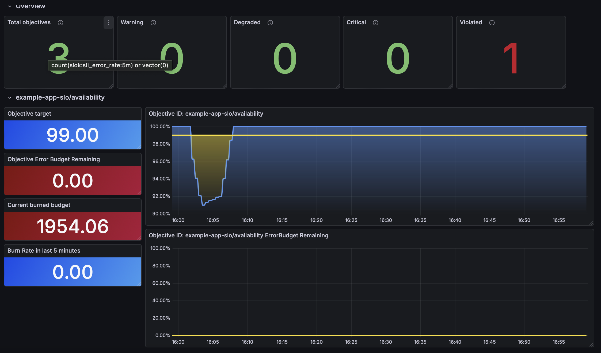

# SLOK - Service Level Objectives for Kubernetes
[](https://opensource.org/licenses/Apache-2.0)
[](https://kubernetes.io)
[](https://goreportcard.com/report/github.com/federicolepera/slok)

SLOK is a Kubernetes operator that manages Service Level Objectives (SLOs) with automatic error budget tracking. Define your reliability targets as Kubernetes resources, and SLOK will continuously monitor them using Prometheus.

## Quick Start

Get your first SLO running:

```bash
# 1. Install the CRDs and operator
kubectl apply -k config/default

# 2. Create your first SLO
cat <<EOF | kubectl apply -f -
apiVersion: observability.slok.io/v1alpha1
kind: ServiceLevelObjective
metadata:
  name: my-api-availability
spec:
  displayName: "My API Availability"
  objective:
    name: availability
    target: 99.9
    window: 7d
    sli:
      query:
        totalQuery: http_requests_total
        errorQuery: http_requests_total{status=~"5.."}
EOF

# 3. Check the status
kubectl get slo
```

## Prerequisites

| Requirement | Version | Notes |
|-------------|---------|-------|
| Kubernetes | 1.20+ | |
| Prometheus | 2.x+ | Must be accessible from the operator |
| Prometheus Operator | (optional) | Required for ServiceMonitor and PrometheusRule |
| cert-manager | 1.0+ | Required if using webhooks |

### Prometheus Setup

SLOK needs to query Prometheus for your SLI metrics. The operator connects to Prometheus via the `PROMETHEUS_URL` environment variable.

If you're using [kube-prometheus-stack](https://github.com/prometheus-community/helm-charts/tree/main/charts/kube-prometheus-stack), Prometheus is typically available at:
```
http://prometheus-kube-prometheus-prometheus.monitoring.svc:9090
```

## Installation

### Option 1: Kustomize (Quick)

```bash
# Install CRDs and deploy operator
kubectl apply -k config/default
```

### Option 2: Helm (Recommended for Production)

```bash
# Add the chart repository (if published) or install from local
helm install slok charts/slok \
  --namespace slok-system \
  --create-namespace \
  --set prometheus.url=http://prometheus-kube-prometheus-prometheus.monitoring.svc:9090
```

#### Helm Configuration

| Parameter | Description | Default |
|-----------|-------------|---------|
| `prometheus.url` | Prometheus server URL | `http://prometheus-kube-prometheus-prometheus.monitoring.svc:9090` |
| `webhook.enabled` | Enable admission webhooks | `true` |
| `metrics.enabled` | Enable metrics endpoint | `true` |
| `prometheusRule.enabled` | Deploy PrometheusRule for SLO alerts | `true` |
| `replicaCount` | Number of operator replicas | `1` |

Disable webhooks (useful for development):
```bash
helm install slok charts/slok \
  --set webhook.enabled=false \
  --set certManager.enabled=false
```

### Verify Installation

```bash
# Check operator is running
kubectl get pods -n slok-system

# Check CRDs are installed
kubectl get crd servicelevelobjectives.observability.slok.io
kubectl get crd slocompositions.observability.slok.io
kubectl get crd slocorrelations.observability.slok.io
```

## SLI Templates

SLOK provides built-in templates for common SLI patterns, eliminating the need to write raw PromQL. Templates automatically generate the correct queries with zero-traffic safety.

### Available Templates

| Template | Description | Required Params |
|----------|-------------|-----------------|
| `http-availability` | HTTP request success rate (non-5xx) | - |
| `http-latency` | HTTP request latency (histogram-based) | `threshold` |
| `kubernetes-apiserver` | Kubernetes API server availability | - |

### http-availability

Measures the ratio of successful HTTP requests (non-5xx) to total requests using `http_requests_total`.

```yaml
apiVersion: observability.slok.io/v1alpha1
kind: ServiceLevelObjective
metadata:
  name: payment-api-availability
spec:
  displayName: "Payment API Availability"
  objective:
    name: availability
    target: 99.9
    window: 30d
    sli:
      template:
        name: http-availability
        labels:
          service: "payment-api"
```

Generated queries:
- `totalQuery`: `http_requests_total{service="payment-api"}`
- `errorQuery`: `http_requests_total{service="payment-api",status=~"5.."}`

### http-latency

Measures the ratio of slow requests (above threshold) to total requests using histogram buckets.

```yaml
apiVersion: observability.slok.io/v1alpha1
kind: ServiceLevelObjective
metadata:
  name: checkout-latency
spec:
  displayName: "Checkout Latency"
  objective:
    name: latency-500ms
    target: 95.0        # 95% of requests should be under 500ms
    window: 7d
    sli:
      template:
        name: http-latency
        labels:
          service: "checkout"
        params:
          threshold: "0.5"  # 500ms in seconds
```

Generated expression:
```promql
1 - (
  sum(rate(http_request_duration_seconds_bucket{service="checkout",le="0.5"}[WINDOW]))
  /
  clamp_min(sum(rate(http_request_duration_seconds_count{service="checkout"}[WINDOW])), 1e-12)
)
```

### kubernetes-apiserver

Measures the ratio of successful Kubernetes API server requests to total requests using `apiserver_request_total`.

```yaml
apiVersion: observability.slok.io/v1alpha1
kind: ServiceLevelObjective
metadata:
  name: apiserver-availability
spec:
  displayName: "API Server Availability"
  objective:
    name: availability
    target: 99.9
    window: 30d
    sli:
      template:
        name: kubernetes-apiserver
        labels:
          verb: "GET"
          resource: "pods"
        params:
          errorCodes: "5.."  # Optional, defaults to "5.."
```

Generated queries:
- `totalQuery`: `apiserver_request_total{verb="GET",resource="pods"}`
- `errorQuery`: `apiserver_request_total{verb="GET",resource="pods",code=~"5.."}`

## Examples

### Availability SLO (using template)

Track the error rate of HTTP requests:

```yaml
apiVersion: observability.slok.io/v1alpha1
kind: ServiceLevelObjective
metadata:
  name: payment-api-availability
spec:
  displayName: "Payment API Availability"
  objective:
    name: availability
    target: 99.9        # Target: 99.9% non-error requests
    window: 30d         # Over a 30-day rolling window
    sli:
      template:
        name: http-availability
        labels:
          service: "payment-api"
```

### Availability SLO (manual queries)

If you need custom queries, you can still use manual PromQL:

```yaml
apiVersion: observability.slok.io/v1alpha1
kind: ServiceLevelObjective
metadata:
  name: payment-api-availability
spec:
  displayName: "Payment API Availability"
  objective:
    name: availability
    target: 99.9
    window: 30d
    sli:
      query:
        totalQuery: http_requests_total{service="payment-api"}
        errorQuery: http_requests_total{service="payment-api", status=~"5.."}
```

### Latency SLO (using template)

Track the percentage of requests above a latency threshold:

```yaml
apiVersion: observability.slok.io/v1alpha1
kind: ServiceLevelObjective
metadata:
  name: checkout-latency
spec:
  displayName: "Checkout Latency"
  objective:
    name: p95-latency
    target: 95.0        # 95% of requests should be under 500ms
    window: 7d
    sli:
      template:
        name: http-latency
        labels:
          service: "checkout"
        params:
          threshold: "0.5"
```

### Check SLO Status

```bash
# Quick overview with printer columns
kubectl get slo
```

Output:
```
NAME                        DISPLAY NAME               STATUS    ACTUAL   TARGET   BUDGET %   AGE
payment-api-availability    Payment API Availability   met       99.95    99.9     50         30d
api-gateway-slo             API Gateway SLO            warning   99.92    99.95    12.5       15d
```

```bash
# Full status detail
kubectl get slo payment-api-availability -o yaml
```

Output:
```yaml
status:
  objective:
    name: availability
    target: 99.9
    actual: 99.87
    status: violated      # met | warning | degraded | critical | violated | unknown
    errorBudget:
      total: "43.2m"
      consumed: "56.2m"
      remaining: "0.0m"
      percentRemaining: 0.0
    burnRate:
      - shortWindow: "5m"
        shortBurnRate: 0.48
        longWindow: "1h"
        longBurnRate: 0.5
      - shortWindow: "1h"
        shortBurnRate: 0.31
        longWindow: "6h"
        longBurnRate: 0.33
      - shortWindow: "6h"
        shortBurnRate: 0.1
        longWindow: "3d"
        longBurnRate: 0.12
      - shortWindow: "7d"
        shortBurnRate: 0.05
        longWindow: "30d"
        longBurnRate: 0.06
    lastQueried: "2026-01-28T10:30:00Z"
  lastUpdateTime: "2026-01-28T10:30:00Z"
  conditions:
    - type: Available
      status: "True"
      reason: Reconciled
```

### Status Values

The objective status is determined by burn rate thresholds (Google SRE Workbook):

| Status | Condition |
|--------|-----------|
| `violated` | Error budget exhausted (remaining <= 0%) |
| `critical` | 5m/1h burn rate both > 14x |
| `degraded` | 1h/6h burn rate both > 6x |
| `warning` | 6h/3d burn rate both > 1x |
| `met` | All burn rates below thresholds |
| `unknown` | Unable to query Prometheus |

### Dashboard

SLOK exports Prometheus metrics that can be visualized in Grafana:



The dashboard shows:
- **Overview**: Total objectives count and status distribution (Warning, Degraded, Critical, Violated)
- **Objective details**: Target, error budget remaining, burned budget, and burn rate
- **Time series**: SLI availability over time and error budget consumption

## Alerting

SLOK generates `PrometheusRule` resources in the same namespace as the SLO. Each
alert type (`budgetErrorAlerts`, `burnRateAlerts`) is independently enabled via its
own `enabled` flag. PrometheusRules are managed idempotently (`CreateOrUpdate`) and
owned by the SLO resource for automatic garbage collection.

### Budget Alerts

Budget alerts fire when the remaining error budget drops below a given percentage.
When `budgetErrorAlerts.enabled` is `true`, SLOK creates two default rules:

- **SLOObjectiveAtRisk** (warning) -- remaining budget is between 0% and 10%.
- **SLOObjectiveViolated** (warning) -- remaining budget is at or below 0%.

You can also add custom thresholds via `budgetErrorAlerts.alerts`:

```yaml
objective:
  name: availability
  target: 99.9
  window: 30d
  sli:
    query:
      totalQuery: http_requests_total{service="payment-api"}
      errorQuery: http_requests_total{service="payment-api", status=~"5.."}
  alerting:
    budgetErrorAlerts:
      enabled: true
      alerts:
        - name: SLOBudgetWarning
          percent: 20        # fires when remaining budget < 20%
          severity: warning
        - name: SLOBudgetCritical
          percent: 5         # fires when remaining budget < 5%
          severity: critical
```

### Burn Rate Alerts

Burn rate alerts use multi-window, multi-burn-rate detection as described in
the [Google SRE Workbook](https://sre.google/workbook/alerting-on-slos/).
The idea is to alert when the error budget is being consumed faster than expected,
rather than waiting for it to run out.

#### Recording Rules

SLOK generates a set of Prometheus recording rules for each objective:

| Rule | Expression | Purpose |
|------|-----------|---------|
| `slok:sli_error_rate:WINDOW` | `sum(rate(errorQuery[WINDOW])) / sum(rate(totalQuery[WINDOW]))` | Error rate over window |
| `slok:error_budget_target` | `vector(1 - target/100)` | Allowed error fraction |
| `slok:burn_rate:WINDOW` | `slok:sli_error_rate:WINDOW / slok:error_budget_target` | Burn rate factor |

Windows: 5m, 1h, 6h, 3d, 7d, 30d. All error rate rules include zero-traffic
safety (`clamp_min` + `OR` fallback) to avoid NaN when there is no traffic.

#### Default Presets

When `burnRateAlerts.enabled` is `true`, SLOK automatically creates four predefined
alert rules based on the Google SRE Workbook approach:

| Alert | Short Window | Long Window | Burn Rate | Severity | Meaning |
|-------|-------------|-------------|-----------|----------|---------|
| `SLOBurnRateHigh - Critical` | 5m | 1h | >14x | critical | Active outage |
| `SLOBurnRateHigh - Degraded` | 1h | 6h | >6x | warning | High burn |
| `SLOBurnRateHigh - Warning` | 6h | 3d | >1x | warning | Steady erosion |
| `ErrorBudget Finished` | -- | objective window | >1x | warning | Budget exhausted |

Each rule fires when **both** the long-window and short-window burn rates exceed
the threshold. The generated expression uses recording rules:

```
slok:burn_rate:SHORT > threshold AND slok:burn_rate:LONG > threshold
```

#### Custom Burn Rate Alerts

You can also define custom burn rate alerts via `burnRateAlerts.alerts`:

| Field | Description |
|-------|-------------|
| `consumePercent` | Percentage of the total error budget that, if consumed within `consumeWindow`, should trigger an alert. |
| `consumeWindow` | The time frame over which `consumePercent` is evaluated (e.g., `1h`). Together with `consumePercent` and the SLO window, this determines the burn rate threshold. |
| `longWindow` | The long observation window for the burn rate subquery (e.g., `1h`). |
| `shortWindow` | The short observation window for the burn rate subquery (e.g., `5m`). Used to confirm the long window signal is not stale. |

Example configuration with two severity tiers:

```yaml
objective:
  name: availability
  target: 99.9
  window: 30d
  sli:
    query:
      totalQuery: http_requests_total{service="payment-api"}
      errorQuery: http_requests_total{service="payment-api", status=~"5.."}
  alerting:
    burnRateAlerts:
      enabled: true
      alerts:
        - name: HighBurnRate
          consumePercent: 2       # 2% of budget consumed in 1h
          consumeWindow: 1h
          longWindow: 1h
          shortWindow: 5m
          severity: critical
        - name: MediumBurnRate
          consumePercent: 5       # 5% of budget consumed in 6h
          consumeWindow: 6h
          longWindow: 6h
          shortWindow: 30m
          severity: warning
```

The burn rate threshold is calculated as:

```
threshold = (consumePercent / 100) * (sloWindow / consumeWindow)
```

For example, with a 30-day window and `consumePercent: 2`, `consumeWindow: 1h`:

```
threshold = 0.02 * 720h / 1h = 14.4
```

If both the long-window and short-window burn rates exceed 14.4, the alert fires.

### Combining Budget and Burn Rate Alerts

You can use both alert types together on the same objective:

```yaml
alerting:
  budgetErrorAlerts:
    enabled: true
    alerts:
      - name: BudgetLow
        percent: 10
        severity: warning
  burnRateAlerts:
    enabled: true
    alerts:
      - name: HighBurnRate
        consumePercent: 2
        consumeWindow: 1h
        longWindow: 1h
        shortWindow: 5m
        severity: critical
```

Budget alerts tell you *how much* budget is left. Burn rate alerts tell you *how fast*
it is being consumed. Using both gives you coverage for slow, sustained degradation
(caught by budget alerts) and sudden spikes (caught by burn rate alerts).

## SLO Composition

SLO Composition allows you to define a higher-level reliability target that aggregates multiple individual SLOs into a single composite view. This is useful when the health of a user journey (e.g. a checkout flow) depends on the availability of several independent services.

### How It Works

SLOK introduces a new CRD: `SLOComposition`. It references a set of existing `ServiceLevelObjective` resources and combines their error rates using a **composition strategy**. The result is a set of Prometheus recording rules and alerts that operate on the aggregated signal.

Currently supported strategies:

| Strategy | Description | Status |
|----------|-------------|--------|
| `AND_MIN` | The composition is healthy only when **all** referenced SLOs are healthy. The error rate is taken as the `max` across all objectives (worst-case). | Stable |
| `WEIGHTED_ROUTES` | Models traffic that flows through different service chains with a given weight (e.g. 90% go through service A→B, 10% through A→C→B). The error rate is computed as a weighted combination of per-route failure probabilities. | Alpha (unstable) |

### AND_MIN

The simplest strategy. The composed error rate is the worst individual error rate across all referenced SLOs, effectively saying "the system is only as reliable as its weakest component."

```yaml
composition:
  type: AND_MIN
```

### WEIGHTED_ROUTES

`WEIGHTED_ROUTES` models systems where different requests follow different paths through your services. You describe each possible path (called a _route_) as an ordered list of component aliases (a _chain_), and assign a weight reflecting how much of your traffic takes that path.

Each service in a chain must succeed for the request to succeed. The success rate of a chain is therefore the product of the individual success rates. The overall composed error rate is:

```
e_total = 1 - sum_i( weight_i × prod_j(1 - e_j) )
```

For example, a checkout flow where 90% of users skip the coupon service and 10% use it:

```
e_total = 1 - (
  0.9 × (1 - e_base) × (1 - e_payments)
  +
  0.1 × (1 - e_base) × (1 - e_coupon) × (1 - e_payments)
)
```

The `objectives` field maps logical aliases to actual `ServiceLevelObjective` resources. The `chain` field references those aliases in order. Weights must sum to `1.0`.

```yaml
composition:
  type: WEIGHTED_ROUTES
  params:
    routes:
      - name: no-coupon
        weight: 0.9
        chain:
          - base
          - payments
      - name: with-coupon
        weight: 0.1
        chain:
          - base
          - coupon
          - payments
```

SLOK translates this formula directly into Prometheus recording rules — one per evaluation window — and wires the result into the same burn rate and alerting pipeline as `AND_MIN`.

> **Note:** `WEIGHTED_ROUTES` is currently in alpha. The API may change before it is marked stable.

### Generated Recording Rules

For each composition SLOK generates the following recording rules:

| Rule | AND_MIN expression | WEIGHTED_ROUTES expression | Purpose |
|------|--------------------|---------------------------|---------|
| `slok:sli_error_composition_rate:WINDOW` | `max by () (slok:sli_error_rate:WINDOW{objective_id=~"..."})` | `1 - sum_i(weight_i × prod_j(1 - scalar(slok:sli_error_rate:WINDOW{...})))` | Composed error rate |
| `slok:objective_target_composition` | `vector(target / 100)` | `vector(target / 100)` | Composition target constant |
| `slok:error_budget_target_composition` | `vector(1 - target / 100)` | `vector(1 - target / 100)` | Allowed error fraction |
| `slok:burn_rate_composition:WINDOW` | `slok:sli_error_composition_rate:WINDOW / slok:error_budget_target_composition` | same | Composition burn rate |

### AND_MIN example

```yaml
apiVersion: observability.slok.io/v1alpha1
kind: SLOComposition
metadata:
  name: example-app-slo-composition
  namespace: default
spec:
  target: 99.9
  window: 30d
  objectives:
    - name: example-app-slo
    - name: k8s-apiserver-availability-slo
  composition:
    type: AND_MIN
```

### WEIGHTED_ROUTES example

See the full annotated example at [config/samples/observability_v1alpha1_slocomposition_weighted_routes.yaml](config/samples/observability_v1alpha1_slocomposition_weighted_routes.yaml).

Apply it with:

```bash
kubectl apply -f k8s/1-sloComp.yaml
```

### Check Composition Status

```bash
# Quick overview (shortName: sloc)
kubectl get sloc
```

Output:
```
NAME                          TARGET   WINDOW   STATUS   ACTUAL   BUDGET %   AGE
example-app-slo-composition   99.9     30d      met      99.95    72.4       15d
```

```bash
# Full status detail
kubectl get sloc example-app-slo-composition -o yaml
```

Output:
```yaml
status:
  objectiveComposition:
    name: example-app-slo-composition
    target: 99.9
    actual: 99.95
    status: met
    errorBudget:
      total: "43200.0m"
      consumed: "11980.8m"
      remaining: "31219.2m"
      percentRemaining: 72.4
    burnRate:
      - shortWindow: "5m"
        shortBurnRate: 0.3
        longWindow: "1h"
        longBurnRate: 0.32
    lastQueried: "2026-02-20T10:30:00Z"
  lastUpdateTime: "2026-02-20T10:30:00Z"
  conditions:
    - type: Available
      status: "True"
      reason: Reconciled
```

### Alerting

Burn rate alerts for compositions follow the same multi-window, multi-burn-rate approach as single SLOs. Enable them via the `alerting` field:

```yaml
spec:
  target: 99.9
  window: 30d
  objectives:
    - name: example-app-slo
    - name: k8s-apiserver-availability-slo
  composition:
    type: AND_MIN
  alerting:
    burnRateAlerts:
      enabled: true
```

When enabled, SLOK generates the same preset alerts as for single SLOs, but referencing the `slok:burn_rate_composition` recording rules:

| Alert | Short Window | Long Window | Burn Rate | Severity |
|-------|-------------|-------------|-----------|----------|
| `Composition: X SLOBurnRateHigh - Critical` | 5m | 1h | >14x | critical |
| `Composition: X SLOBurnRateHigh - Degraded` | 1h | 6h | >6x | warning |
| `Composition: X SLOBurnRateHigh - Warning` | 6h | 3d | >1x | warning |
| `Composition: X ErrorBudget Finished - Violated` | -- | composition window | -- | warning |

### Limitations

- Budget error alerts (`budgetErrorAlerts`) are not yet supported for compositions; only burn rate alerts are available.
- `WEIGHTED_ROUTES` is alpha: validation of weights (must sum to 1.0, no duplicate aliases, non-empty chains) is not yet enforced by the webhook.

---

## Event Correlation

SLOK automatically correlates SLO degradation with cluster changes to help identify root causes. When a burn rate spike is detected, SLOK creates an `SLOCorrelation` resource that lists recent changes that may have caused the problem.

### How It Works

1. **Change Collection**: SLOK watches Deployments, ConfigMaps, Secrets, and Events in the cluster
2. **Spike Detection**: When the burn rate suddenly increases, SLOK triggers correlation analysis
3. **Time Window Analysis**: SLOK looks at changes from 30 minutes before to 10 minutes after the spike
4. **Confidence Scoring**: Each change is scored based on timing, namespace, resource type, and label matching

### SLOCorrelation CRD

When a burn rate spike is detected, SLOK creates an `SLOCorrelation` resource:

```bash
# List all correlations
kubectl get slocorr

# Output:
NAME                              SLO                 SEVERITY   BURN RATE   EVENTS   DETECTED              AGE
example-app-slo-2026-02-06-1520   example-app-slo     critical   100         2        2026-02-06T15:20:00Z  5m
```

```bash
# View correlation details
kubectl get slocorr example-app-slo-2026-02-06-1520 -o yaml
```

```yaml
apiVersion: observability.slok.io/v1alpha1
kind: SLOCorrelation
metadata:
  name: example-app-slo-2026-02-06-1520
  namespace: default
spec:
  sloRef:
    name: example-app-slo
    namespace: default
status:
  detectedAt: "2026-02-06T15:20:00Z"
  burnRateAtDetection: 100
  previousBurnRate: 0.5
  severity: critical
  window:
    start: "2026-02-06T14:50:00Z"
    end: "2026-02-06T15:30:00Z"
  correlatedEvents:
    - kind: Deployment
      name: example-app
      namespace: default
      timestamp: "2026-02-06T15:18:00Z"
      changeType: update
      change: "image: myapp:v1.4.2"
      actor: kubectl
      confidence: high
  summary: "Burn rate spike (critical) likely caused by Deployment default/example-app: image: myapp:v1.4.2"
  eventCount: 1
```

### Workload Selector

Use `workloadSelector` to filter which cluster changes are considered during correlation. This reduces noise by only including changes to resources related to your SLO.

```yaml
apiVersion: observability.slok.io/v1alpha1
kind: ServiceLevelObjective
metadata:
  name: payment-api-availability
spec:
  displayName: "Payment API Availability"
  workloadSelector:
    labelSelector:
      app: payment-api
      team: platform
    namespaces:            # Optional: defaults to SLO namespace
      - production
      - staging
  objective:
    name: availability
    target: 99.9
    window: 30d
    sli:
      template:
        name: http-availability
        labels:
          service: "payment-api"
```

| Field | Description |
|-------|-------------|
| `labelSelector` | Only include resources with ALL specified labels |
| `namespaces` | Limit correlation to these namespaces (defaults to SLO namespace) |

Without `workloadSelector`, SLOK considers all changes in the SLO's namespace.

### Confidence Scoring

Each correlated event receives a confidence level based on multiple factors:

| Factor | Score | Description |
|--------|-------|-------------|
| **Time proximity** | +30 | Change within 15 minutes of spike |
| | +15 | Change within 60 minutes of spike |
| | +5 | Change outside 60 minutes |
| **Same namespace** | +20 | Change in the same namespace as SLO |
| **Resource type** | +25 | Deployment changes |
| | +20 | ConfigMap changes |
| | +15 | Secret changes |
| | -5 | Event (usually a consequence, not cause) |
| **Label match** | +30 | Resource labels match `workloadSelector.labelSelector` |

Final confidence level:
- **high**: Score >= 50
- **medium**: Score >= 25
- **low**: Score < 25

### LLM-Enhanced Summary (Optional)

When the `GROQ_API_KEY` environment variable is set, SLOK sends the correlated events to a large language model (Llama 3.3 70B on Groq) for smarter root cause analysis. The LLM overrides the default summary with a more accurate assessment that:

- Prioritizes events that intentionally bring capacity to zero over secondary symptoms
- Ignores probe failures and pod churn when a clear root cause exists
- Re-evaluates confidence levels independently from the scoring engine

This feature is **optional** -- without the environment variable, SLOK uses the built-in rule-based summary.

```bash
# Enable LLM-enhanced correlation
export GROQ_API_KEY="gsk_..."
```

| Setting | Value |
|---------|-------|
| Provider | [Groq](https://console.groq.com) |
| Model | `llama-3.3-70b-versatile` |
| Timeout | 30 seconds |
| Fallback | Rule-based summary if API call fails |

### Watched Resources

| Resource | What's Tracked | Example Diff |
|----------|---------------|--------------|
| Deployment | Container images, replicas | `image: myapp:v1.4.3` |
| ConfigMap | Key count changes | `keys: 5` |
| Secret | Type and key count (no values) | `type: Opaque, keys: 3` |
| Event | CrashLoopBackOff, OOMKilled, FailedScheduling, etc. | `OOMKilled: Container exceeded memory limit` |

## Limitations

### Current Version

| Limitation | Description | Workaround |
|------------|-------------|------------|
| **Instant queries only** | Uses Prometheus instant query for status, recording rules for SLI | Recording rules handle the rate/window computation |
| **No multi-cluster support** | One operator per cluster | Deploy SLOK in each cluster |
| **Fixed reconciliation interval** | SLOs are re-evaluated every 1 minute | Cannot be configured per-SLO |
| **Prometheus Operator required for alerts** | PrometheusRule generation requires the Prometheus Operator CRDs | Install the Prometheus Operator or disable alerting |

### Query Requirements

You can define SLIs using either **templates** (recommended) or **manual queries**.

**Using templates** (recommended): Select a template and provide labels to filter metrics.
SLOK generates the correct PromQL automatically with zero-traffic safety.

**Using manual queries**: Define two Prometheus metric selectors: `errorQuery` (error events)
and `totalQuery` (total events). SLOK generates recording rules that compute the
error rate for multiple time windows.

Each manual query field should contain a **metric selector** (metric name with optional label
matchers). The operator wraps these in `sum(rate(...[window]))` when generating
recording rules. Do **not** include `sum()`, `rate()`, or `increase()` in the queries.

**Good queries (metric selectors):**
```yaml
sli:
  query:
    totalQuery: http_requests_total{service="payment-api"}
    errorQuery: http_requests_total{service="payment-api", status=~"5.."}
```

**Bad query** (includes PromQL functions -- the operator adds these automatically):
```yaml
sli:
  query:
    totalQuery: sum(rate(http_requests_total{service="payment-api"}[5m]))
    errorQuery: sum(rate(http_requests_total{service="payment-api", status=~"5.."}[5m]))
```

**Bad query** (returns a multi-element vector -- always use a specific label selector):
```yaml
sli:
  query:
    totalQuery: http_requests_total
    errorQuery: http_requests_total{status=~"5.."}
# This works if there is exactly one matching series; use specific labels to ensure that.
```

The generated recording rules produce these metrics:
```
slok:sli_error_rate:5m   = sum(rate(errorQuery[5m])) / sum(rate(totalQuery[5m]))
slok:sli_error_rate:1h   = sum(rate(errorQuery[1h])) / sum(rate(totalQuery[1h]))
slok:sli_error_rate:6h   = ...
slok:sli_error_rate:3d   = ...
slok:sli_error_rate:7d   = ...
slok:sli_error_rate:30d  = ...
```

The controller queries `slok:sli_error_rate:5m` to compute the current SLI and
error budget, and `slok:burn_rate:*` for burn rate status.

### Error Budget Calculation

The operator calculates the error budget from the error rate returned by the
recording rules:

```
error_rate        = slok:sli_error_rate:5m (from recording rule)
actual            = 100 - (error_rate * 100)
error_budget      = (100 - target) / 100 * window_in_seconds
consumed          = error_rate * window_in_seconds
remaining         = error_budget - consumed
percent_remaining = (remaining / error_budget) * 100
```

Example for a 99.9% target over 30 days:
- Error budget: 0.1% of 30 days = 43.2 minutes
- If error rate is 0.0013 (actual = 99.87%), consumed = 0.13% of 30 days = 56.2 minutes
- Remaining = 0 (budget exhausted, status: **violated**)

## Development

```bash
# Run locally (against current kubeconfig)
make run

# Run tests
make test

# Build Docker image
make docker-build IMG=your-registry/slok:latest

# Deploy to cluster
make deploy IMG=your-registry/slok:latest
```

## License

Apache License 2.0 - see [LICENSE](LICENSE) for details.
